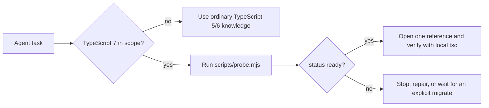

# TypeScript 7 Skill for Claude Code, Codex, Cursor, and other AI Coding Agents

[](LICENSE)
[](https://devblogs.microsoft.com/typescript/announcing-typescript-7-0/)
[](https://agentskills.io/specification)

An [Agent Skill](https://agentskills.io/specification) that teaches **Cursor**, **Claude Code**, **Codex**, **GitHub Copilot**, **Gemini CLI**, and other coding agents how to write, migrate, and diagnose **TypeScript 7** — the native Go `tsc` (Corsa), not a new type system.

Pinned to **TypeScript 7.0.2** and the VS Code / Cursor extension `TypeScriptTeam.native-preview` **0.20260708.2**. Language facts apply on every OS.

TypeScript 7.0 shipped 8 July 2026 as a faithful Go port of the **6.0 checker**. Generics, narrowing, and mapped types did not change. What *did* change — and what models trained on TypeScript 5 still get wrong — is the **defaults**, the **hard errors**, a handful of **language deltas** (Unicode template `infer`, JSDoc rewritten to match `.ts`), a new native **`tsc`**, native **LSP**, and **no stable `import "typescript"` compiler API**.

If you are searching for `tsgo`, `native-preview`, Corsa vs Strada, `ignoreDeprecations`, `createProgram`, `--checkers`, `Iterator.prototype.map`, `Temporal`, or `using` / `DisposableStack` on a TypeScript 7 project, this skill is the briefing your agent is missing.

## Why this exists

**For you:** the agent stops “fixing” a red `tsc` by toggling the editor server, inventing flags, writing TypeScript 5 in a 7.0 tree, or “upgrading” eslint by pretending TypeScript 7 exports `ts.createProgram`. Migration follows the real map: 6.0 warned, 7.0 refuses.

**For the agent:** a scope gate so it does not fire on ordinary TypeScript 5/6 work; a local-only probe that names the real `tsc`; one reference page per job instead of the whole tree; a pin so advice does not drift to a nightly.



## What this skill can do

| Job | What the agent actually does |
| --- | --- |
| Write TypeScript 7 | Emit `.ts` / `.tsx` / `.d.ts` that typecheck under 7.0 defaults (`strict`, `module: esnext`, `target: es2025`, `types: []`, `rootDir`, `verbatimModuleSyntax`, `nodenext`) |
| Migrate 5.x / 6.0 → 7.0 | Fix tsconfig first, then source. Delete `ignoreDeprecations: "6.0"` — 7.0 does not honor it |
| Dual-stack tooling | Keep native `tsc` 7 for typecheck; keep TypeScript **6.0.2** Strada (`tsc6`, `import "typescript"`) for eslint, ts-morph, TypeDoc, webpack loaders |
| Diagnose | Separate CLI `tsc` from editor LSP (`js/ts.experimental.useTsgo`), config from language, lib types from runtime |
| Run native `tsc` | Invoke the probe’s `compilerPath`. Documented 7.0-new flags: `--checkers`, `--builders`, `--singleThreaded` |
| Stay inside copyright | Summarize bundled lib APIs. Does not vendor Microsoft sources |

It is **not** a beginner handbook, a React/Vue/Svelte/Angular course, or a trigger for every TypeScript edit. It activates when the repo or the user has put TypeScript 7 in scope.

## What TypeScript 7 actually is

| Name you will see | What it means on this pin |
| --- | --- |
| **TypeScript 7.0 / TS7** | GA native compiler. Package `typescript@7.0.2`. Binary is `tsc`, version `7.x.x` |
| **Corsa** | Internal name for the Go port (`microsoft/typescript-go`) |
| **Strada** | The JS TypeScript 6 line **and** its `import "typescript"` API |
| **tsgo** | Preview executable name. GA retired it; do not keep calling `tsgo` on 7.0.2 |
| **native-preview** | Preview npm package / extension publisher id `TypeScriptTeam.native-preview` |
| **@typescript/native** | Dual-stack alias for native 7 while `typescript` stays on 6 |
| **@typescript/typescript6** | Strada 6.0.2 sidecar (`tsc6`) |
| **stableTypeOrdering** | On in 7.0 and **cannot be turned off** |
| **ignoreDeprecations** | `"6.0"` is not an escape hatch on 7.0 |

Microsoft’s compatibility sentence: code that compiles on 6.0 with `stableTypeOrdering` and **without** `ignoreDeprecations` should compile on 7.0, aside from documented language deltas (Unicode `infer`, JSDoc). Published full-build speedups vs 6.0 are typically **8–12×**.

## Contents of this TypeScript 7 Skill / TS 7 Skill

These are the identifiers this skill actually teaches. Click through when you are stuck on one of them.

### Product, install, and “where did `tsc` go?”

`typescript@7.0.2` · `@typescript/native` · `@typescript/typescript6@6.0.2` · `@typescript/native-preview` · `typescript@next` · `tsc` · `tsc6` · `tsgo` · `compilerPath` · `stradaCompilerPath` · `scripts/probe.mjs`

See [install-and-dual-stack.md](references/install-and-dual-stack.md) and [start-here-and-versioning.md](references/start-here-and-versioning.md).

### Compiler API that is **not** in 7.0

`import "typescript"` · `import * as ts from "typescript"` · `ts.createProgram` · `ts.transpileModule` · `ts.transform` · `typescript/unstable/sync` · `typescript/unstable/async` · `typescript/unstable/ast` · `lib/version.cjs` · ts-morph · typescript-eslint parser · TypeDoc · API Extractor · `ts-loader`

See [no-compiler-api.md](references/no-compiler-api.md). Dual-stack; do not invent a native API.

### tsconfig defaults and hard breaks

`strict` · `noImplicitAny` · `strictNullChecks` · `module: esnext` · `moduleResolution: nodenext` / `bundler` · `target: es2025` · `types: []` · `rootDir` · `baseUrl` (removed) · `moduleResolution: node` / `node10` / `classic` (illegal) · `target: es5` (illegal) · `outFile` · `downlevelIteration` · `esModuleInterop` · `allowSyntheticDefaultImports` · `alwaysStrict` · `verbatimModuleSyntax` · `isolatedModules` · `isolatedDeclarations` · `exactOptionalPropertyTypes` · `noUncheckedIndexedAccess` · `noUncheckedSideEffectImports` · `libReplacement` · `ignoreDeprecations` · `import type` · import attributes `with { type: "json" }` (not `assert { ... }`) · `process` not found until `"types": ["node"]`

See [tsconfig-defaults-and-breaks.md](references/tsconfig-defaults-and-breaks.md) and [compiler-options.md](references/compiler-options.md).

### CLI, watch, and project references

`--checkers` · `--builders` · `--singleThreaded` · `--watch` · `--build` / `-b` · `--showConfig` · `--help` · `--pretty false` · `--noEmit` · `--ignoreConfig` · `@parcel/watcher`

See [cli-watch-and-parallelism.md](references/cli-watch-and-parallelism.md) and [project-references-and-build.md](references/project-references-and-build.md).

### ES2025 lib (default `target` on this pin)

`Iterator.from` · `Iterator.prototype.map` / `filter` / `take` / `drop` / `flatMap` / `reduce` / `toArray` · `Promise.try` · `Float16Array` · `Set.prototype.union` / `intersection` / `difference` / `symmetricDifference` · `isSubsetOf` / `isSupersetOf` / `isDisjointFrom` · `RegExp.escape` · `Intl.DurationFormat`

Node 22 already includes iterator helpers, `Array.fromAsync`, and Set methods. That does **not** mean every ES2025 or ESNext API exists at runtime.

See [lib-es2025.md](references/lib-es2025.md) and [lib-inventory.md](references/lib-inventory.md).

### ESNext lib (ahead of default `target`)

`Map.prototype.getOrInsert` · `getOrInsertComputed` · `Temporal` · `Date.prototype.toTemporalInstant` · `Array.fromAsync` · `Uint8Array.fromBase64` · `Error.isError` · `Atomics.pause` · `using` · `await using` · `Symbol.dispose` · `Symbol.asyncDispose` · `Disposable` · `AsyncDisposable` · `DisposableStack` · `AsyncDisposableStack` · `SuppressedError` · `Symbol.metadata` · `ClassMethodDecoratorContext`

See [lib-esnext.md](references/lib-esnext.md), [using-and-disposables.md](references/using-and-disposables.md), and [decorators.md](references/decorators.md).

### Language and utility types

`Partial` · `Pick` · `Omit` · `Record` · `Awaited` · `Exclude` · `Extract` · `NonNullable` · `Uppercase` / `Lowercase` / `Capitalize` / `Uncapitalize` · template-literal `infer` · `Length<S>` on emoji · `satisfies` · `using` · standard decorators vs `experimentalDecorators`

See the language pages in the index below.

### Editor / LSP

`TypeScriptTeam.native-preview` · `js/ts.experimental.useTsgo` · TypeScript 7 language server (not tsserver) · tsserver plugins **do not load** on the native LS

See [editor-lsp-and-vsix.md](references/editor-lsp-and-vsix.md).

## Reference index

Agents open **one** of these from [SKILL.md](SKILL.md). Unread files cost nothing.

| Page | Use when |
| --- | --- |
| [writing-typescript.md](references/writing-typescript.md) | Writing or editing `.ts` / `.tsx` / `.d.ts` in a verified 7.x project |
| [migrating-to-7.md](references/migrating-to-7.md) | The user asked to move 5.x or 6.0 onto 7.0.2 |
| [diagnosing-failures.md](references/diagnosing-failures.md) | CLI red, emit wrong, tool cannot load `typescript`, editor ≠ CLI |
| [start-here-and-versioning.md](references/start-here-and-versioning.md) | What “TypeScript 7” names, Corsa / Strada / tsgo |
| [install-and-dual-stack.md](references/install-and-dual-stack.md) | Exact install, `tsc` + `tsc6` aliases, CI, nightlies |
| [tsconfig-defaults-and-breaks.md](references/tsconfig-defaults-and-breaks.md) | 6.0 defaults 7.0 now hard-errors |
| [compiler-options.md](references/compiler-options.md) | Flags that change legal source |
| [cli-watch-and-parallelism.md](references/cli-watch-and-parallelism.md) | `--checkers` / `--builders` / `--singleThreaded` / `--watch` |
| [project-references-and-build.md](references/project-references-and-build.md) | Solution builds and `-b` |
| [no-compiler-api.md](references/no-compiler-api.md) | Missing `createProgram`; Strada sidecar |
| [editor-lsp-and-vsix.md](references/editor-lsp-and-vsix.md) | Native LSP vs CLI `tsc` |
| [lib-inventory.md](references/lib-inventory.md) | `lib` vs `target` vs runtime |
| [lib-es2025.md](references/lib-es2025.md) | Default-target ES2025 surfaces |
| [lib-esnext.md](references/lib-esnext.md) | Temporal, `getOrInsert`, `fromAsync`, … |
| [types-everyday.md](references/types-everyday.md) | Primitives, arrays, tuples, `any` / `unknown` / `never` |
| [narrowing-and-control-flow.md](references/narrowing-and-control-flow.md) | Guards and control flow |
| [functions-and-call-signatures.md](references/functions-and-call-signatures.md) | Overloads, rest, `this` parameters |
| [objects-and-interfaces.md](references/objects-and-interfaces.md) | Optional properties, index signatures |
| [unions-intersections-and-never.md](references/unions-intersections-and-never.md) | Discriminants, exhaustiveness, union order |
| [generics-inference-and-variance.md](references/generics-inference-and-variance.md) | Constraints, inference, variance |
| [type-manipulation.md](references/type-manipulation.md) | `keyof`, indexed access, mapped and conditional types |
| [template-literals-and-infer.md](references/template-literals-and-infer.md) | Unicode code-point `infer` (7.0 delta) |
| [classes-and-this.md](references/classes-and-this.md) | Classes and `this` |
| [decorators.md](references/decorators.md) | TC39 decorators and `Symbol.metadata` |
| [modules-imports-and-exports.md](references/modules-imports-and-exports.md) | `import type`, import attributes, `nodenext` |
| [jsx-syntax.md](references/jsx-syntax.md) | TSX and `compilerOptions.jsx` |
| [using-and-disposables.md](references/using-and-disposables.md) | `using` / `await using` / `DisposableStack` |
| [javascript-and-jsdoc.md](references/javascript-and-jsdoc.md) | Checked `.js` and JSDoc rewrite |
| [declaration-files.md](references/declaration-files.md) | `.d.ts` and `isolatedDeclarations` |
| [utility-types.md](references/utility-types.md) | `Partial`, `Pick`, `Omit`, `Awaited`, … |
| [sources.md](references/sources.md) | Pin, primary sources, license boundary |

## Install

The installed folder **must** be named `typescript-7` (it has to match the skill `name`). Copy or clone the **whole** directory. `SKILL.md` alone is not enough — agents need `scripts/probe.mjs` and `references/`.

Do not install into `~/.cursor/skills-cursor/` (Cursor built-ins).

Leave `disable-model-invocation` unset so the skill can auto-trigger on TypeScript 7 work.

After the GitHub repo is public, replace `OWNER/typescript-7-skill` with this repository’s path. Use `npx skills@latest` so a root-level `SKILL.md` installs `scripts/` and `references/`, not just the router.

### Fastest installer

User-scope (every project on this machine):

```bash
npx skills@latest add OWNER/typescript-7-skill -g -y
```

Project-scope (commit it with the repo so the team shares it):

```bash
npx skills@latest add OWNER/typescript-7-skill -y
```

Target one host:

```bash
npx skills@latest add OWNER/typescript-7-skill -g -a cursor -y
npx skills@latest add OWNER/typescript-7-skill -g -a claude-code -y
npx skills@latest add OWNER/typescript-7-skill -g -a codex -y
npx skills@latest add OWNER/typescript-7-skill -g -a github-copilot -y
npx skills@latest add OWNER/typescript-7-skill -g -a gemini-cli -y
```

GitHub CLI (this repo’s `SKILL.md` lives at the root, so pass that path):

```bash
gh skill install OWNER/typescript-7-skill SKILL.md --scope user --agent cursor
```

`--agent` also accepts `claude-code`, `codex`, `github-copilot`, `gemini-cli`, `opencode`, `windsurf`, `amp`, and many others. Several hosts share `.agents/skills/` at project scope, so one install can serve Cursor, Codex, Copilot, and Gemini together.

### Ask your agent to install it

Paste one of these into the agent. Point `SOURCE` at this checkout or, after publish, at the GitHub URL.

**Any Agent Skills host**

```text
Install the TypeScript 7 Agent Skill at user scope for this coding agent.

Source: SOURCE
Skill folder name MUST be typescript-7 (it has to match the name field in SKILL.md).

1. Install the full directory (SKILL.md, scripts/, references/). Do not copy SKILL.md alone.
2. Prefer a Windows directory junction or a POSIX symlink to the checkout so updates stay live. Copy only if linking is impossible.
3. Place it at this agent's global skills path. Common paths:
   - Cursor: ~/.cursor/skills/typescript-7
   - Claude Code: ~/.claude/skills/typescript-7
   - Codex: ~/.codex/skills/typescript-7 (also scans ~/.agents/skills/typescript-7)
   - GitHub Copilot: ~/.copilot/skills/typescript-7 or ~/.agents/skills/typescript-7
   - Gemini CLI: ~/.gemini/skills/typescript-7 or ~/.agents/skills/typescript-7
4. Never install into ~/.cursor/skills-cursor/.
5. Confirm the destination contains SKILL.md, scripts/probe.mjs, and references/, then report the path.
```

**Cursor**

```text
Install the TypeScript 7 Agent Skill for Cursor at user scope.

Source: SOURCE
Destination: ~/.cursor/skills/typescript-7

The folder name must be typescript-7. Install the full skill (SKILL.md, scripts/, references/), not SKILL.md alone. On Windows, create a directory junction to the checkout. On macOS/Linux, symlink. Do not install into ~/.cursor/skills-cursor/. Confirm SKILL.md and scripts/probe.mjs exist at the destination, then tell me the path.
```

**Claude Code**

```text
Install the TypeScript 7 Agent Skill for Claude Code at user scope.

Source: SOURCE
Destination: ~/.claude/skills/typescript-7

Folder name must be typescript-7. Copy or symlink the full skill directory (SKILL.md, scripts/, references/). Confirm SKILL.md exists at the destination, then tell me the path. Leave auto-invocation enabled.
```

**Codex**

```text
Install the TypeScript 7 Agent Skill for Codex at user scope.

Source: SOURCE
Destination: ~/.codex/skills/typescript-7

Folder name must be typescript-7. Install the full directory. On Windows, create a directory junction (not a file symlink) from ~/.codex/skills/typescript-7 to the checkout. On macOS/Linux, symlink. Codex also reads ~/.agents/skills/; one junction at ~/.codex/skills is enough if that is where this install already lives. Confirm SKILL.md and scripts/probe.mjs exist at the destination, then tell me the path.
```

**GitHub Copilot**

```text
Install the TypeScript 7 Agent Skill for GitHub Copilot at user scope.

Source: SOURCE
Destination: ~/.agents/skills/typescript-7 (canonical) or ~/.copilot/skills/typescript-7

Folder name must be typescript-7. Install the full skill directory. Confirm SKILL.md exists at the destination, then tell me the path.
```

**Gemini CLI**

```text
Install the TypeScript 7 Agent Skill for Gemini CLI at user scope.

Source: SOURCE
Destination: ~/.gemini/skills/typescript-7 or ~/.agents/skills/typescript-7

Folder name must be typescript-7. Install the full skill directory. Confirm SKILL.md exists at the destination, then tell me the path.
```

### Where each host looks

| Host | User (global) | Project (this repo) |
| --- | --- | --- |
| Cursor | `~/.cursor/skills/typescript-7/` | `.agents/skills/typescript-7/` or `.cursor/skills/typescript-7/` |
| Claude Code | `~/.claude/skills/typescript-7/` | `.claude/skills/typescript-7/` |
| Codex | `~/.codex/skills/typescript-7/` and `~/.agents/skills/typescript-7/` | `.agents/skills/typescript-7/` |
| GitHub Copilot | `~/.agents/skills/typescript-7/` or `~/.copilot/skills/typescript-7/` | `.agents/skills/typescript-7/` or `.github/skills/typescript-7/` |
| Gemini CLI | `~/.gemini/skills/typescript-7/` or `~/.agents/skills/typescript-7/` | `.agents/skills/typescript-7/` |
| OpenCode, Amp, Cline, Warp, Windsurf, … | host-specific; many share `~/.agents/skills/` | often `.agents/skills/typescript-7/` |

### Windows junctions

On Windows, a **directory junction** is the reliable way to keep an editable checkout linked into the agent’s skills folder (file symlinks often need extra privileges; junctions do not). Codex on this machine is installed that way:

```powershell
New-Item -ItemType Junction `
  -Path "$env:USERPROFILE\.codex\skills\typescript-7" `
  -Target "C:\dev\skills\typescript-7-skill"
```

Same pattern for Cursor:

```powershell
New-Item -ItemType Directory -Force -Path "$env:USERPROFILE\.cursor\skills" | Out-Null
New-Item -ItemType Junction `
  -Path "$env:USERPROFILE\.cursor\skills\typescript-7" `
  -Target "C:\dev\skills\typescript-7-skill"
```

Replace the `-Target` with your clone path. After publish, clone first, then junction the clone.

POSIX equivalent:

```bash
mkdir -p ~/.cursor/skills
ln -s /path/to/typescript-7-skill ~/.cursor/skills/typescript-7
```

## How an agent should use it

1. Confirm TypeScript 7 is in scope from the request or the repository (`typescript@7`, `tsgo`, `native-preview`, Corsa, a 7.x `tsc`).
2. From that project directory, run `node <skill-root>/scripts/probe.mjs --json`. The probe never searches a registry for a package named `tsc`.
3. Continue only on `ready`. `not-targeting-typescript-7` or `uninitialized` is a boundary, not permission to migrate or initialize.
4. Open **one** reference linked from [SKILL.md](SKILL.md). Verify with the same local compiler. If it stays red, open [diagnosing-failures.md](references/diagnosing-failures.md).

## Layout

```text
typescript-7/
  SKILL.md                 # agent router (loaded when the skill fires)
  README.md                # humans / GitHub
  LICENSE                  # MIT for original prose
  scripts/probe.mjs        # local-only compiler/scope probe
  scripts/probe.test.mjs
  scripts/validate-skill.mjs
  scripts/validate-skill.test.mjs
  evals/activation-cases.json
  references/              # one page per job
```

## Frequently asked questions

### What is TypeScript 7?

TypeScript 7.0 is a native **Go** port of the TypeScript **6.0** type-checker and emit, plus a native language server. It is not a new type system. The GA pin this skill teaches is **7.0.2**.

### Is TypeScript 7 a new language like 4.0 was?

No. Major 7 is a port (Corsa), not a language-feature drop. The surprises are 6.0’s defaults plus a few Corsa deltas: Unicode template `infer`, JSDoc aligned with `.ts`, native CLI parallelism, native LSP, and no stable compiler API.

### What is tsgo vs tsc?

`tsgo` was the **preview** executable. TypeScript 7 GA ships `tsc`. If a build script still calls `tsgo` or installs `@typescript/native-preview` after you moved to 7.0.2, update it.

### What is Corsa vs Strada?

Corsa is the Go compiler (TypeScript 7 `tsc`). Strada is the JavaScript TypeScript 6 compiler **and** the `import "typescript"` API. Dual-stack repos run both on purpose.

### Does TypeScript 7 have a compiler API?

**No stable API in 7.0.** `ts.createProgram`, `ts.transpileModule`, ts-morph, and typescript-eslint still need TypeScript **6.0.2** (Strada). The 7.0.2 package root export is `lib/version.cjs`, not the old compiler. Paths under `typescript/unstable/*` are not a drop-in API. See [no-compiler-api.md](references/no-compiler-api.md).

### Why did eslint / ts-morph / TypeDoc break after I installed TypeScript 7?

Those tools `import "typescript"`. Point the `typescript` package at `@typescript/typescript6@6.0.2` and put native 7 on `@typescript/native`. Keep CLI typecheck on 7. Do not polyfill a 7.0 API.

### Why does `ignoreDeprecations: "6.0"` not work?

TypeScript 7.0 does not honor it. 6.0 warned; 7.0 hard-errors the deprecated flags and syntax (`target: es5`, `moduleResolution: node10`, `baseUrl`, import assertions with `assert`, …). Fix the named breaks. See [tsconfig-defaults-and-breaks.md](references/tsconfig-defaults-and-breaks.md).

### Why is `process` not found?

Default `"types": []` does not auto-include `@types/node`. Set `"types": ["node"]` (or the packages you actually need).

### Why does emit land in `dist/src`?

Default `rootDir` is the tsconfig directory. Set `"rootDir": "./src"` if your sources live in `src/`.

### Can I turn off `stableTypeOrdering`?

No. It is on in 7.0 and cannot be disabled. Union order in `.d.ts` follows that.

### How do I migrate TypeScript 5 to TypeScript 7?

Adopt 6.0 defaults and delete deprecated flags *as if* you were still on 6.0, then install `typescript@7.0.2`. Jumping 5 → 7 skips the deprecation messages and presents hard errors. See [migrating-to-7.md](references/migrating-to-7.md).

### How do I use TypeScript 7 with Cursor, Claude Code, or Codex?

Install this skill into that host’s skills folder (junction on Windows, symlink elsewhere, or `npx skills@latest add`). The agent should auto-trigger when the project or the task names TypeScript 7. You can also invoke it as `/typescript-7` in hosts that expose skills as slash commands.

### Will this skill take over ordinary TypeScript 5 or 6 work?

No. The frontmatter description excludes ordinary TypeScript 5/6 edits and migrations you did not request. The probe will report `not-targeting-typescript-7` or `uninitialized` rather than installing 7 on its own.

### Why is the editor red when `tsc` is clean (or the reverse)?

The TypeScript 7 language server is a **separate** process from CLI `tsc`. Merge gates should trust the verified local compiler. Do not “fix” a CLI error by toggling `js/ts.experimental.useTsgo`. Native LS also does not load tsserver plugins.

### Does a type existing in `lib` mean Node implements it?

No. A bundled declaration proves the checker knows the name. Check the project’s minimum runtime feature by feature. Node 22 has iterator helpers, `Array.fromAsync`, and Set methods; it does not thereby implement `Temporal` or every ESNext API.

### Why did my emoji `infer` / `Length<>` utility break?

TypeScript 7 pulls a **Unicode code point** for empty template `infer` placeholders. TypeScript 5/6 (Strada) split by UTF-16 code unit, so `"😀"` used to infer as two surrogate halves. See [template-literals-and-infer.md](references/template-literals-and-infer.md).

### What are `--checkers` and `--builders`?

New native-`tsc` parallelism. `--checkers` (default 4) partitions typecheck work; `--builders` parallelizes project-reference builds. They **multiply** memory. `--singleThreaded` is the fair 6-vs-7 comparison switch. See [cli-watch-and-parallelism.md](references/cli-watch-and-parallelism.md).

### Is this the official TypeScript handbook?

No. It is an Agent Skill: a router plus one-hop references written so a coding agent will probe, open one page, and verify with the project-local compiler. Microsoft’s bundled libs, blogs, and VSIX stay under their own licenses. This skill does not vendor them.

## Validate changes

From this repository:

```text
node --test scripts/probe.test.mjs scripts/validate-skill.test.mjs
node scripts/validate-skill.mjs
```

The validator checks frontmatter boundaries, direct reference routing, relative links, exact knowledge pins, safe compiler invocation guidance, terminology, and a small set of high-risk runtime facts. It does not grade prose or replace compiler/release-note verification.

## License

Original skill prose and scripts: **MIT**. Microsoft TypeScript files, blogs, and the VSIX remain under their own licenses (Apache-2.0 for the compiler libs). This skill does **not** vendor those sources.

Pin and primary sources: [references/sources.md](references/sources.md).

## Copyright

[Synfonia LLC](https://synfonia.io) © 2026. All rights reserved.
